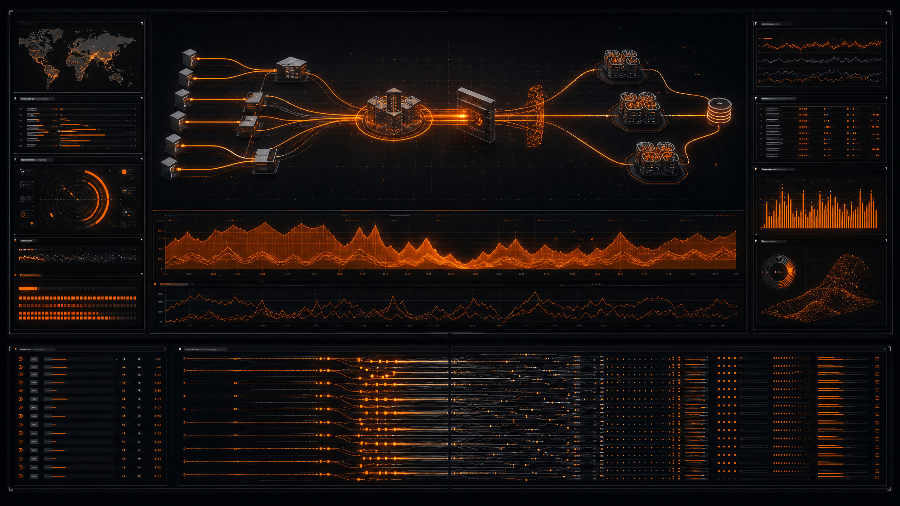
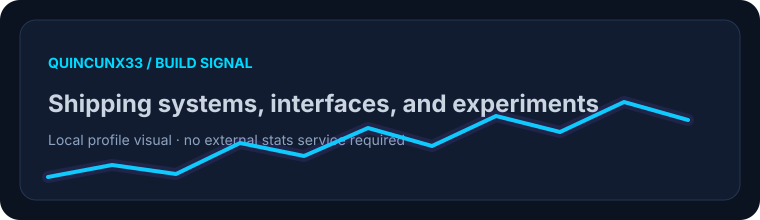
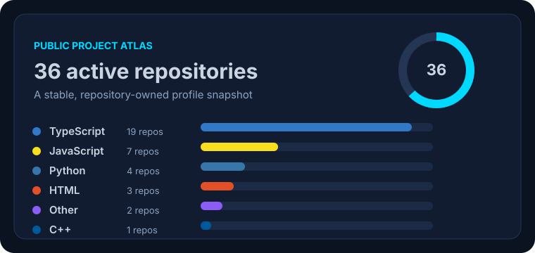

  

 

  <h1>Tasfiya Tabassum</h1>
  
<strong>Full-Stack Developer · Security Tooling · Experimental Interfaces</strong>

  
Building useful experiments where systems, interfaces, and the modern web meet.

   
  
  
  

  

  <a href="#about">About</a> ·
  <a href="#featured-lab">Featured Lab</a> ·
  <a href="#project-atlas">Project Atlas</a> ·
  <a href="#toolkit">Toolkit</a> ·
  <a href="#activity">Activity</a> ·
  <a href="#connect">Connect</a>

 

## About

I am a developer from **Khulna, Bangladesh**, focused on turning ambitious ideas into practical, browser-first software. My work moves across **TypeScript, Python, real-time applications, browser APIs, WebAssembly, automation, and responsible security research**.

I enjoy taking difficult ideas—distributed transfer, private communication, performance testing, interactive computer vision, or emulation—and shaping them into interfaces that feel clear, capable, and memorable.

> **Build principle:** keep the experience elegant, keep the implementation thoughtful, and keep learning in public.

## Featured Lab

Five projects, five different signals: performance, infrastructure, responsible testing, and connected systems.

<table>
<tr>
<td width="50%">

### Stress-Tester

A cluster-driven HTTP load generator and WAF audit platform for **authorized testing environments**. It turns traffic, latency, and resilience into readable engineering signals.

<a href="https://github.com/Quincunx33/Stress-Tester">Open the Stress-Tester lab →</a>

</td>
<td width="50%">

### stress-test-server

A dependable benchmarking target with live request logs, health signals, REST endpoints, and predictable synthetic fixtures.

<a href="https://github.com/Quincunx33/stress-test-server">Open the test server →</a>

</td>
</tr>
<tr>
<td width="50%">

### stressTest-landing

A control-room style landing experience for exposing API bottlenecks, latency cliffs, and failure thresholds before production.

<a href="https://github.com/Quincunx33/stressTest-landing">Open the pipeline →</a>

</td>
<td width="50%">

### Bolt-share

A peer-to-peer file-sharing concept built around direct device connections, secure transfer paths, and a clear transfer experience.

<a href="https://github.com/Quincunx33/Bolt-share">Open Bolt-share →</a>

</td>
</tr>
</table>

<table>
<tr>
<td width="42%">

</td>
<td width="58%">

### bomber-v2

An asynchronous messaging and API-testing laboratory. The profile presents it as a **controlled, educational, authorized testing project**, with emphasis on rate limits, observability, and responsible use.

<a href="https://github.com/Quincunx33/bomber-v2">Open the bomber-v2 repository →</a>

</td>
</tr>
</table>

## More Visual Builds

Two additional systems projects with their own visual identity.

<table>
<tr>
<td width="50%">

### Virtual-machine

A mobile-first browser virtual machine emulator powered by **libv86**, **WebAssembly**, event-driven communication, and careful memory cleanup.

<a href="https://github.com/Quincunx33/Virtual-machine">Open Virtual-machine →</a>

</td>
<td width="50%">

### EthicalHackingTools

Project Sirra: a modular and cross-platform security testing environment with safe orchestration, scanner modules, sandboxing, and multi-format reporting.

<a href="https://github.com/Quincunx33/EthicalHackingTools">Open Project Sirra →</a>

</td>
</tr>
</table>

## Recently Shipped

The newest public builds are collected here so the profile stays easy to scan without losing the full repository atlas below.

<strong>Systems, interfaces &amp; developer tools</strong>

| Project | What it is | Stack |
|---|---|---|
| [mycat-companion](https://github.com/Quincunx33/mycat-companion) | Cross-platform desktop cat companion with pet care, Pomodoro focus sessions, sticky notes, sounds, eye tracking, and dark skins. | Python |
| [cronjob](https://github.com/Quincunx33/cronjob) | Visual cron and HTTP ping dashboard with next-run visibility, execution history, and deduplicated failure alerts. | TypeScript |
| [personal-portfolio](https://github.com/Quincunx33/personal-portfolio) | React/Vite portfolio for experiments, security tooling, systems work, and the modern web. | TypeScript |
| [ipad-simulation](https://github.com/Quincunx33/ipad-simulation) | Interactive iPad mini and iPadOS-inspired browser simulator with responsive controls and Liquid Glass-style surfaces. | TypeScript |

<strong>Security research &amp; defensive analysis</strong>

| Project | What it is | Stack |
|---|---|---|
| [phishGard](https://github.com/Quincunx33/phishGard) | Defensive server-side phishing URL analysis with headless auditing and supplemental intelligence. | TypeScript |
| [Ai-jailbreak](https://github.com/Quincunx33/Ai-jailbreak) | A red-team and AI safety research collection covering prompt-injection and model robustness techniques. | Research |

> These security-focused projects are presented for authorized testing, defensive analysis, and AI-safety research only.

<strong>Creative computing &amp; scientific interaction</strong>

| Project | What it is | Stack |
|---|---|---|
| [solar-sclipse](https://github.com/Quincunx33/solar-sclipse) | Interactive 3D total solar eclipse simulator with a historical replay archive. | TypeScript |

## Project Atlas

Use the expandable sections below to browse the wider project constellation.

<strong>Security, networking & developer tooling</strong>

| Project | Direction | Link |
| :--- | :--- | :--- |
| **EthicalHackingTools** | Project Sirra: modular security testing, orchestration, sandboxing, and vulnerability assessment. | [Explore](https://github.com/Quincunx33/EthicalHackingTools) |
| **Stress-Tester** | HTTP load generation, benchmarking, and WAF auditing for authorized environments. | [Explore](https://github.com/Quincunx33/Stress-Tester) |
| **stress-test-server** | Benchmarking target with live logging, cleanup jobs, and synthetic discovery fixtures. | [Explore](https://github.com/Quincunx33/stress-test-server) |
| **stressTest-landing** | Landing experience for HTTP load testing and API performance benchmarking. | [Explore](https://github.com/Quincunx33/stressTest-landing) |
| **ammo.js** | JavaScript port of the Bullet physics engine through Emscripten. | [Explore](https://github.com/Quincunx33/ammo.js) |

<strong>Communication, media & file workflows</strong>

| Project | Direction | Link |
| :--- | :--- | :--- |
| **Bolt-share** | Peer-to-peer file sharing for local and online transfer. | [Explore](https://github.com/Quincunx33/Bolt-share) |
| **CipherChat** | Real-time communication and modern chat interface experiments. | [Explore](https://github.com/Quincunx33/CipherChat) |
| **CipherChat6** | Focused cipher and communication interface experiment. | [Explore](https://github.com/Quincunx33/CipherChat6) |
| **cipherchat-e2ee** | End-to-end encrypted communication concepts. | [Explore](https://github.com/Quincunx33/cipherchat-e2ee) |
| **Ip-tv** | StreamTube: streaming interface with caching and media organization. | [Explore](https://github.com/Quincunx33/Ip-tv) |
| **ip-tv-** | Additional IPTV and media interface exploration. | [Explore](https://github.com/Quincunx33/ip-tv-) |
| **open-download** | Focused download utility experiment. | [Explore](https://github.com/Quincunx33/open-download) |
| **cx-download-manager-permanent** | Persistent video download manager with metadata collection. | [Explore](https://github.com/Quincunx33/cx-download-manager-permanent) |
| **bomber-telegram-bot** | Telegram automation experiment for controlled and educational use. | [Explore](https://github.com/Quincunx33/bomber-telegram-bot) |
| **bomber-v2** | Async SMS, call, and email testing tool for educational use. | [Explore](https://github.com/Quincunx33/bomber-v2) |

<strong>Interactive experiences & simulations</strong>

| Project | Direction | Link |
| :--- | :--- | :--- |
| **naruto-sasuke** | Hand tracking with real-time effects powered by MediaPipe and Gemini. | [Explore](https://github.com/Quincunx33/naruto-sasuke) |
| **Cardriving** | Browser driving and interactive simulation experience. | [Explore](https://github.com/Quincunx33/Cardriving) |
| **Skyrun** | Simulation-focused TypeScript experiment. | [Explore](https://github.com/Quincunx33/Skyrun) |
| **fastroads** | Fast-paced road simulation built around a modified Roadster experience. | [Explore](https://github.com/Quincunx33/fastroads) |
| **PS2-WebXperience** | PlayStation-inspired browser interaction and visual experience. | [Explore](https://github.com/Quincunx33/PS2-WebXperience) |
| **cyberpunk-** | Cyberpunk-themed visual and interface experiment. | [Explore](https://github.com/Quincunx33/cyberpunk-) |
| **ipad-simulation** | iPad-inspired interface simulation. | [Explore](https://github.com/Quincunx33/ipad-simulation) |

<strong>Browser, emulation & cross-platform experiments</strong>

| Project | Direction | Link |
| :--- | :--- | :--- |
| **PyBrowser** | Terminal OS and Python playground concepts using browser technologies and WebAssembly. | [Explore](https://github.com/Quincunx33/PyBrowser) |
| **v86-vm-app** | Browser-based emulation with boot flows, monitoring, and a 3D interface. | [Explore](https://github.com/Quincunx33/v86-vm-app) |
| **Virtual-machine** | Emulator experiment delivered through the browser. | [Explore](https://github.com/Quincunx33/Virtual-machine) |
| **arm64-shell-app** | Mobile terminal emulator concept for arm64 environments. | [Explore](https://github.com/Quincunx33/arm64-shell-app) |
| **Flash-Lite-Browser** | Lightweight browser concept focused on speed and interface. | [Explore](https://github.com/Quincunx33/Flash-Lite-Browser) |
| **Infinite-Drive** | AI-assisted drive experience and interface experiment. | [Explore](https://github.com/Quincunx33/Infinite-Drive) |
| **uxos** | Interface and operating-environment experiment. | [Explore](https://github.com/Quincunx33/uxos) |
| **RDP** | Remote desktop and access-oriented experimentation. | [Explore](https://github.com/Quincunx33/RDP) |

<strong>Creative builds & portfolio work</strong>

| Project | Direction | Link |
| :--- | :--- | :--- |
| **Opec-valley** | TypeScript creative experience. | [Explore](https://github.com/Quincunx33/Opec-valley) |
| **Data** | Lightweight HTML data and interface experiment. | [Explore](https://github.com/Quincunx33/Data) |
| **app** | JavaScript application experiment. | [Explore](https://github.com/Quincunx33/app) |
| **downlod-** | Download-focused TypeScript experiment. | [Explore](https://github.com/Quincunx33/downlod-) |
| **remix-personal-portfolio** | Personal portfolio built with modern TypeScript tooling. | [Explore](https://github.com/Quincunx33/remix-personal-portfolio) |

## Toolkit

  

  
  
  
  

## Activity

These visuals are stored inside this repository, so the profile does not depend on a third-party statistics service to render its key story.

  

  

  

## Connect

  
  
  
  

  

  Built with curiosity · shipped with care · always iterating

