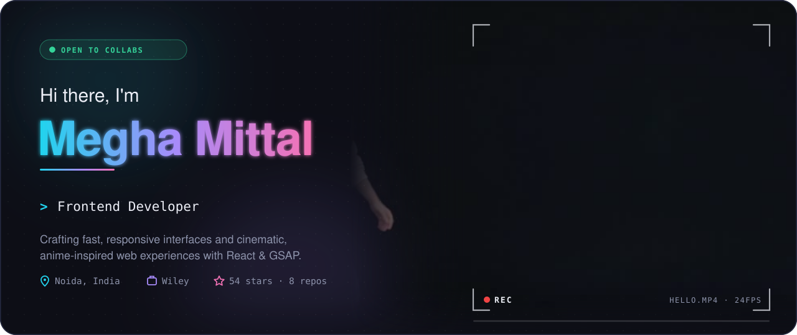

## Featured builds

| Project | What it is | Stack |
|:---|:---|:---|
| [**Stress-Tester**](https://github.com/Quincunx33/Stress-Tester) | Cluster-driven HTTP load generation, benchmarking and WAF auditing for authorized environments. | `Python` `HTTP` `Security` |
| [**Bolt-share**](https://github.com/Quincunx33/Bolt-share) | Peer-to-peer file sharing with direct device connections and clear transfer flows. | `TypeScript` `WebRTC` |
| [**Virtual-machine**](https://github.com/Quincunx33/Virtual-machine) | Browser-based virtualization and emulation experiment. | `JavaScript` `WebAssembly` |
| [**EthicalHackingTools**](https://github.com/Quincunx33/EthicalHackingTools) | Modular security testing, orchestration, sandboxing and defensive reporting. | `Python` `Security` |
| [**phishGard**](https://github.com/Quincunx33/phishGard) | Defensive server-side phishing URL analysis and headless auditing. | `TypeScript` `Security` |
| [**mycat-companion**](https://github.com/Quincunx33/mycat-companion) | Cross-platform desktop companion with focus sessions, notes, sounds and dark skins. | `Python` |

## GitHub contribution city

*Every commit builds another tower — refreshed automatically every day.*

  
**Always learning, always building.**

> Security and penetration-testing projects are intended only for authorized labs, defensive analysis, responsible research and learning.
