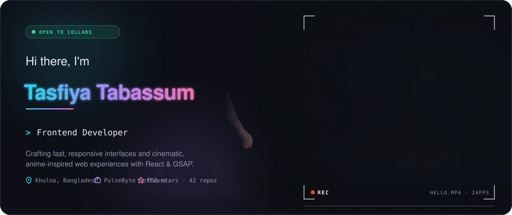

## Featured builds

| Project | What it is | Stack |
|:---|:---|:---|
|  [**Ai-jailbreak**](https://github.com/Quincunx33/Ai-jailbreak)  | Jailbreak prompt collection and exploit-technique research for authorized AI red-teaming and safety work. | `JavaScript` `AI Safety` |
|  [**Virtual-machine**](https://github.com/Quincunx33/Virtual-machine)  | Emulator for booting a classic 32-bit operating system in the browser. | `JavaScript` `WebAssembly` |
|  [**Stress-Tester**](https://github.com/Quincunx33/Stress-Tester)  | Cluster-driven HTTP load generation, benchmarking and WAF auditing for authorized environments. | `TypeScript` `HTTP` `Security` |
|  [**StressTest-wasm**](https://github.com/Quincunx33/StressTest-wasm)  | WebAssembly-based stress testing and performance benchmarking tool. | `Rust` `WebAssembly` |
|  [**image-forensics**](https://github.com/Quincunx33/image-forensics)  | Privacy-first in-browser image forensics with ELA, FFT, DCT, noise and copy-move analysis. | `TypeScript` `Rust` `WebAssembly` |
|  [**hostOnion**](https://github.com/Quincunx33/hostOnion)  | Host PHP sites as Tor v3 onion services with health checks and hardened runtime controls. | `Python` `Tor` `Security` |
|  [**bomber-v2**](https://github.com/Quincunx33/bomber-v2)  | Cross-platform high-speed SMS and email testing tool with interactive workflows and proxy support. | `Python` `Cross-platform` |

## GitHub contribution city

*Every commit builds another tower — refreshed automatically every day.*

  

**Always learning, always building.**

> Security and penetration-testing projects are intended only for authorized labs, defensive analysis, responsible research and learning.
